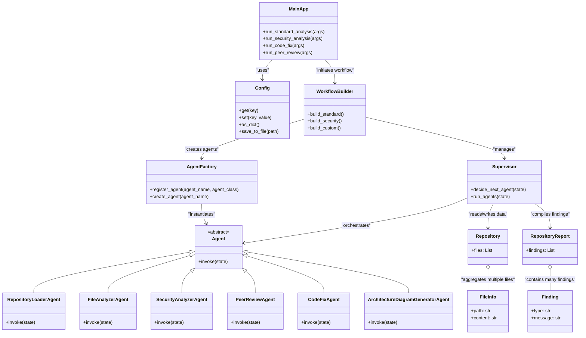

# Class/Module Dependency Diagram

MainApp is the entry point that uses a Config object to manage configuration and leverages a WorkflowBuilder to initiate a workflow for different analysis types (standard, security, code fix, and peer review). WorkflowBuilder, in turn, uses both an AgentFactory (to instantiate the necessary agents) and a Supervisor (to coordinate the overall process). The Supervisor orchestrates the flow of operations among various Agents, reads and writes data from a Repository (which contains multiple FileInfo objects representing individual files), and ultimately compiles findings into a RepositoryReport.

Agent is defined as an abstract class whose concrete subclasses (RepositoryLoaderAgent, FileAnalyzerAgent, SecurityAnalyzerAgent, PeerReviewAgent, CodeFixAgent, and ArchitectureDiagramGeneratorAgent) each implement their own invoke method for specialized tasks. AgentFactory is responsible for creating these specific Agents upon request by registering their classes and creating instances when needed. Meanwhile, the Repository aggregates multiple FileInfo objects, and the RepositoryReport holds multiple Finding objects, further illustrating the composition relationships within the system.

